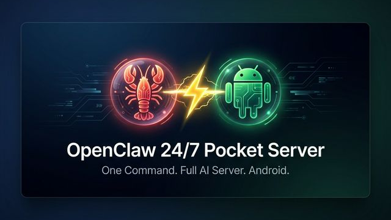

# 🦞 OpenClaw Pocket Server



> Turn any Android phone into a **24/7 AI server** — one command, zero hassle.


An enhanced, battle-tested installer for [OpenClaw](https://openclaw.ai) on Android via Termux. Runs natively — no proot, no Ubuntu, no bloat.

## ⚡ Why a Phone?

| Benefit | Details |
|---|---|
| 🔋 **Low power + built-in UPS** | Runs 24/7 on minimal power; battery survives outages |
| 📱 **Repurpose old phones** | Put that spare phone to work instead of buying a mini PC |
| 🚀 **Sufficient performance** | Even older models handle OpenClaw easily |
| 🔒 **Zero risk** | Factory-reset a spare phone, no personal data involved |

## 📦 What's Included

| Feature | Details |
|---|---|
| 🦞 OpenClaw | Latest version, auto-installed |
| 🔒 SSH Server | Auto-configured, port `8022`, default password `1234` |
| 🖥️ tmux Session | Persistent `OpenClaw` session for the gateway |
| 🔄 Auto-Start | Termux:Boot script for restart recovery |
| 📸 Image Processing | `sharp` native module built from source |
| 🔧 Native Fixes | `renameat2`, `ar` symlink, `--disable-warning` bypass |
| ⚡ Wakelock | Prevents Android from killing the process |

## 📲 Required Apps

Install these from **F-Droid** (NOT the Play Store):

| App | Version | Download |
|---|---|---|
| **Termux** | 0.118.3+ | [F-Droid](https://f-droid.org/en/packages/com.termux/) |
| **Termux:Boot** | 0.8.1+ | [F-Droid](https://f-droid.org/en/packages/com.termux.boot/) |
| **Termux:API** | 0.53.0+ | [F-Droid](https://f-droid.org/en/packages/com.termux.api/) |

> ⚠️ The Play Store version of Termux is discontinued and will **not** work.

> After installing Termux:Boot, **open it once** to grant boot permissions.

## 🚀 Quick Install (One Command)

Open Termux and paste:

```bash
curl -sL https://raw.githubusercontent.com/PsProsen-Dev/openclaw-pocket-server/main/bootstrap.sh | bash && source ~/.bashrc
```

That's it. The installer handles everything:

1. ✅ Installs Node.js, npm, build tools, tmux, SSH
2. ✅ Installs OpenClaw globally
3. ✅ Patches for Android compatibility (renameat2, paths, platform)
4. ✅ Builds `sharp` for image processing
5. ✅ Configures SSH server (port 8022, password `1234`)
6. ✅ Sets up Termux:Boot auto-start script
7. ✅ Runs verification checks

## 🛠️ After Installation

### Step 1: Configure OpenClaw

```bash
openclaw onboard
```

Follow the interactive wizard to set your AI provider (Google, OpenRouter, Copilot, etc.).

### Step 2: Start the Gateway

Create a persistent tmux session and start the gateway:

```bash
tmux new-session -s OpenClaw
openclaw gateway
```

**Detach** (keep running in background): `Ctrl+B` then `D`

**Reattach** later:
```bash
tmux attach -t OpenClaw
```

### Step 3: Connect from Your PC

```bash
ssh -p 8022 <username>@<phone-ip>
```

Default password: `1234`

> Find your phone's IP: run `ifconfig` in Termux and look for `wlan0` → `inet`.

### Step 4: Access the Dashboard

Set up an SSH tunnel from your PC:

```bash
ssh -N -L 18789:127.0.0.1:18789 -p 8022 <username>@<phone-ip>
```

Then open in your browser: `http://localhost:18789/`

> Run `openclaw dashboard` on the phone to get the full URL with token.

## 🔐 SSH Setup

### Change Password

The default password is `1234`. Change it:

```bash
passwd
```

### Use SSH Keys (Recommended)

On your PC, generate a key and copy it:

```bash
ssh-keygen -t ed25519 -f ~/.ssh/openclaw_key -N ""
ssh-copy-id -i ~/.ssh/openclaw_key.pub -p 8022 <username>@<phone-ip>
```

Connect without password:

```bash
ssh -i ~/.ssh/openclaw_key -p 8022 <username>@<phone-ip>
```

## 📱 Phone Setup Tips

### Enable Stay Awake

1. **Settings** > **About phone** > Tap **Build number** 7 times (enables Developer Options)
2. **Settings** > **Developer options** > Enable **Stay awake**

### Set Charge Limit to 80%

Running 24/7 at 100% can damage the battery.

- **Samsung**: Settings > Battery > Battery Protection → Maximum 80%
- **Pixel**: Settings > Battery > Battery Protection → ON

### Disable Battery Optimization

1. **Settings** > **Battery** > **Battery optimization**
2. Find **Termux** → set to **Not optimized** / **Unrestricted**

## 🔧 Troubleshooting

<details>
<summary><b>❌ <code>error: expected absolute path: "--disable-warning=ExperimentalWarning"</code></b></summary>

**Cause**: OpenClaw tries to respawn Node.js with `--disable-warning` flag, which conflicts with `NODE_OPTIONS` on Node v24+.

**Fix**: Already handled by the installer (`OPENCLAW_NODE_OPTIONS_READY=1`). If you see this after an update:

```bash
echo 'export OPENCLAW_NODE_OPTIONS_READY=1' >> ~/.bashrc
source ~/.bashrc
```
</details>

<details>
<summary><b>❌ <code>make: ar: No such file or directory</code> (sharp build)</b></summary>

**Cause**: Termux's `binutils` installs `llvm-ar` but doesn't create the `ar` symlink that `node-gyp` expects.

**Fix**:
```bash
ln -sf $PREFIX/bin/llvm-ar $PREFIX/bin/ar
npm rebuild sharp --prefix $PREFIX/lib/node_modules/openclaw
```
</details>

<details>
<summary><b>❌ <code>renameat2</code> / <code>RENAME_NOREPLACE</code> undeclared</b></summary>

**Cause**: Android Bionic doesn't expose `renameat2()` in older API levels.

**Fix**: Already handled by `termux-compat.h`. If rebuilding:
```bash
export CXXFLAGS="-include $HOME/.openclaw-android/patches/termux-compat.h"
```
</details>

<details>
<summary><b>❌ SSH password not working</b></summary>

**Cause**: If the password was set from a Windows script, CRLF line endings may have corrupted it.

**Fix**:
```bash
passwd
# Type your new password twice
```
</details>

<details>
<summary><b>❌ Gateway shows <code>ECONNREFUSED</code></b></summary>

**Cause**: The gateway process isn't running.

**Fix**:
```bash
source ~/.bashrc
tmux new-session -s OpenClaw
openclaw gateway
```
</details>

<details>
<summary><b>❌ tmux: no sessions</b></summary>

The tmux session was lost (phone rebooted or process killed). Create a new one:

```bash
tmux new-session -s OpenClaw
openclaw gateway
```

For auto-recovery on reboot, ensure Termux:Boot is installed and opened once.
</details>

<details>
<summary><b>❌ WARNING: REMOTE HOST IDENTIFICATION HAS CHANGED</b></summary>

The phone's SSH host key changed (usually after reinstalling Termux).

**Fix** (on your PC):
```bash
ssh-keygen -R "[<phone-ip>]:8022"
```
</details>

## 🔄 Update

```bash
openclaw update
```

Or re-run the installer to refresh patches:

```bash
curl -sL https://raw.githubusercontent.com/PsProsen-Dev/openclaw-pocket-server/main/bootstrap.sh | bash && source ~/.bashrc
```

## 🗑️ Uninstall

```bash
npm uninstall -g openclaw
rm -rf ~/.openclaw ~/.openclaw-android ~/openclaw-pocket-server
# Remove the environment block from ~/.bashrc manually
```

## 📁 Project Structure

```
openclaw-pocket-server/
├── bootstrap.sh                  # curl one-liner entry point
├── install.sh                    # Master installer (10 steps)
├── scripts/
│   ├── check-env.sh              # Pre-flight checks
│   ├── install-deps.sh           # Termux packages
│   ├── setup-env.sh              # .bashrc environment config
│   ├── setup-ssh.sh              # SSH server + password
│   ├── setup-tmux.sh             # tmux session info
│   └── setup-boot.sh             # Termux:Boot auto-start
├── patches/
│   ├── termux-compat.h           # renameat2 + RENAME_NOREPLACE
│   ├── bionic-compat.js          # Platform + os patches
│   ├── spawn.h                   # POSIX spawn stub
│   ├── patch-paths.sh            # /tmp → $PREFIX/tmp etc.
│   ├── apply-patches.sh          # Patch orchestrator + ar fix
│   └── systemctl                 # systemctl stub
├── tests/
│   └── verify-install.sh         # Post-install health check
├── docs/
│   ├── troubleshooting.md        # Full troubleshooting guide
│   └── ssh-guide.md              # SSH key setup guide
├── LICENSE                       # MIT
└── .gitignore
```

## 🎁 Bonus: AI CLI Tools

The compatibility patches also enable popular AI CLI tools:

| Tool | Install |
|---|---|
| [Gemini CLI](https://github.com/google-gemini/gemini-cli) | `npm i -g @google/gemini-cli` |
| [Claude Code](https://github.com/anthropics/claude-code) | `npm i -g @anthropic-ai/claude-code` |
| [Qwen CLI](https://github.com/QwenLM/qwen-cli) | `npm i -g @anthropic-ai/qwen-cli` |
| [Codex CLI](https://github.com/openai/codex) | `npm i -g @openai/codex` |

## 🙏 Credits

- [OpenClaw](https://openclaw.ai) — The AI agent framework
- Built with ⚡ by **Jarvis (RTX⚡🦞)** for [**PsProsen-Dev**](https://github.com/PsProsen-Dev)

## 📄 License

MIT — do whatever you want with it.
